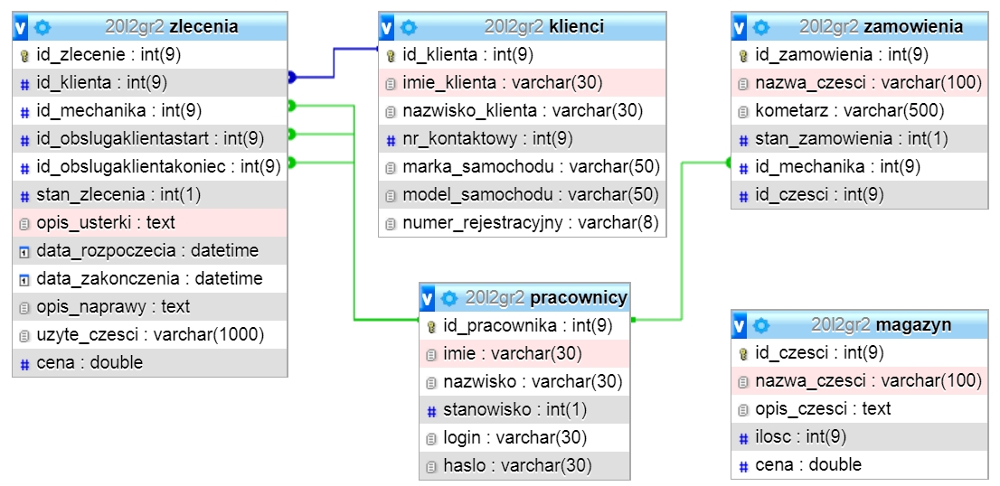

Aplikacja wspomagające zarządzanie warsztatem samochodowym

Opis projektu:

Tematem projektu jest aplikacja do obsługi warsztatu samochodowego. Aplikacja ta ma na celu wspomaganie pracy warsztatu samochodowego, przechowywania danych klientów i historii napraw wykonywanych przez warsztat oraz rozdzielanie zadań dla poszczególnych pracowników.

System kont uzytkowników zostanie rozdzielony na 4 typy użytkowników:
- administrator
- mechanik
- pracownik działu obsługi
- magazynier.

W celu skorzystania z aplikacji wymagane będzie zalogowanie się. Zadania poszczególnych użytkowników przedstawiają się następująco:

1. Administrator 
- zajmuje się tworzeniem kont pracowników (dlatego, iż to jest system działający w obrębie firmy)
- ma możliwości modyfikacji wszystkich danych, które zostały wprowadzone w tym systemie

2. Mechanik
- przyjmowanie zleceń
- wprowadzanie zapotrzebowania na daną część
- raportowanie wykonanej pracy

3. Pracownik działu obsługi
- przyjmowanie zleceń od klientów
- wycenianie wykonanych usług

4. Magazynier
- Sprawdzanie ilości towaru oraz wyszukiwanie konkretnych części

Zlecenie może przyjąć 3 stany:
- oczekiwaniu na realizację
- zlecenie w realizacji
- zlecenie zrealizowane

Funkcjonalności naszej aplikacji:

- Przyjmowanie zleceń od klientów
- Przydzielanie zadań poszczególnym pracownikom
- Raportowanie wykonanych zadań
- Nadzorowanie stanu magazynu
- Wgląd do historii wykonywanych napraw
- Zarządzanie zleceniami

Diagram klas

Diagram przypadków użycia

Diagram sekwencji

Diagram stanów

Diagram aktywności

Diagram ERD

Wykorzystane narzędzia i technologie:

- IntelliJ
- GitHub
- Jira
- JavaFx
- Maven
- MySQL (w przyszłości)

Twórcy:

- Albrycht Adrian 
- Bieda Andrzej
- Borek Kamil
- Cwynar Wiktor 
- Kluk Paweł

UWAGA! Projekt jest w trakcie realizacji - dokumentacja README.md będzie sukcesywnie aktualizowana!
