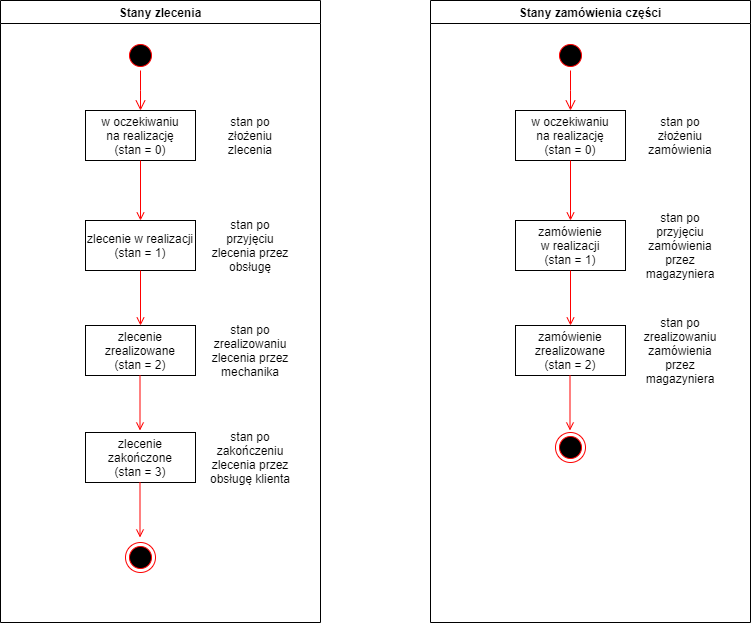
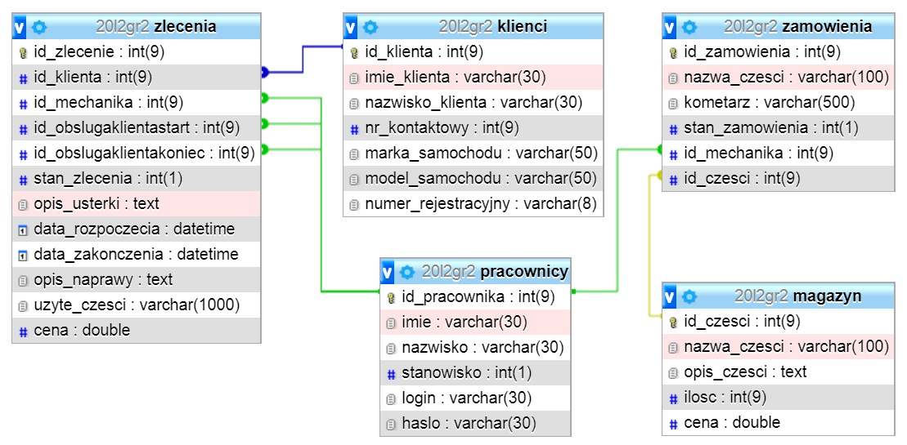

Aplikacja wspomagające zarządzanie warsztatem samochodowym

Opis projektu:

Tematem projektu jest aplikacja do obsługi warsztatu samochodowego. Aplikacja ta ma na celu wspomaganie pracy warsztatu samochodowego, przechowywania danych klientów i historii napraw wykonywanych przez warsztat oraz rozdzielanie zadań dla poszczególnych pracowników.

System kont uzytkowników zostanie rozdzielony na 4 typy użytkowników:
- administrator
- mechanik
- pracownik działu obsługi
- magazynier.

W celu skorzystania z aplikacji wymagane będzie zalogowanie się. Zadania poszczególnych użytkowników przedstawiają się następująco:

1. Administrator 
- zajmuje się tworzeniem kont pracowników (dlatego, iż to jest system działający w obrębie firmy)
- ma możliwości modyfikacji wszystkich danych, które zostały wprowadzone w tym systemie (konta użytkowników, zamówienia, zlecenia, części)

2. Mechanik
- przyjmowanie zleceń od dzialu obslugi klienta
- wprowadzanie zapotrzebowania na daną część
- wybieranie części potrzebnych do wykonania naprawy
- raportowanie wykonanych napraw

3. Pracownik działu obsługi
- przyjmowanie zleceń od klientów
- dodawanie nowych klientow do bazy
- wycenianie wykonanych usług
- wyszukiwanie zleceń
- przeglądanie historii zleceń

4. Magazynier
- Sprawdzanie ilości dostępnych części
- wyszukiwanie konkretnych części
- Przyjmowanie zamówień na części od mechanika oraz określenie czy zamówienie na daną część zostało zrealizowane czy jest w trakcie realizacji

Zlecenie może przyjąć 3 stany:
- oczekiwaniu na realizację
- zlecenie w realizacji
- zlecenie zrealizowane

Funkcjonalności naszej aplikacji:

- Przyjmowanie zleceń od klientów
- Przydzielanie zadań poszczególnym pracownikom
- Raportowanie wykonanych zadań
- Nadzorowanie stanu magazynu
- Wgląd do historii wykonywanych napraw
- Zarządzanie zleceniami

Diagram klas

Diagram przypadków użycia

Diagram sekwencji

Diagram stanów

Diagram aktywności

Diagram ERD

Dokumentacja użytkownika znajduje się [w tym miejscu](Dokumetacja%20użytkownika.pdf).

Dokumentacja instalacji znajduje się [w tym miejscu](Dokumetacja%20Instalacji.pdf).

Wykorzystane narzędzia i technologie:

- IntelliJ
- GitHub
- Jira
- JavaFx
- Maven
- MySQL

Twórcy:

- Albrycht Adrian 
- Bieda Andrzej
- Borek Kamil
- Cwynar Wiktor 
- Kluk Paweł
